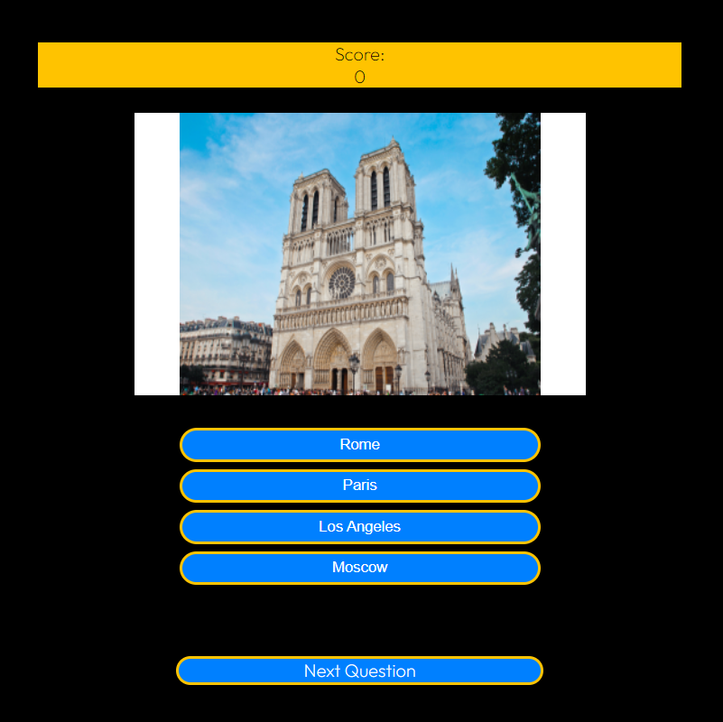
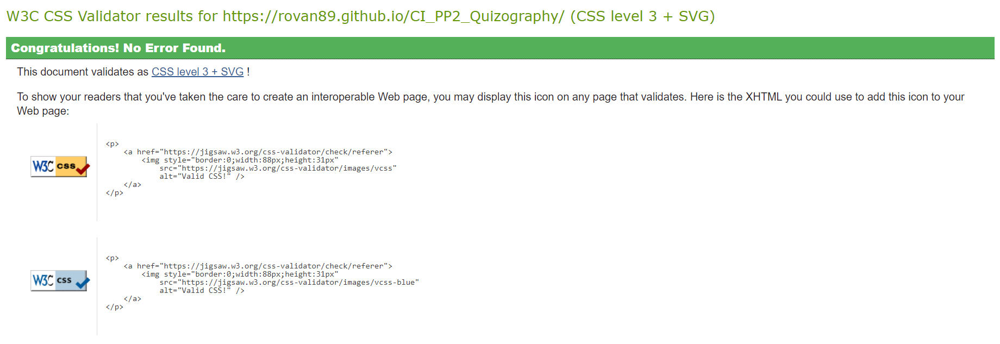
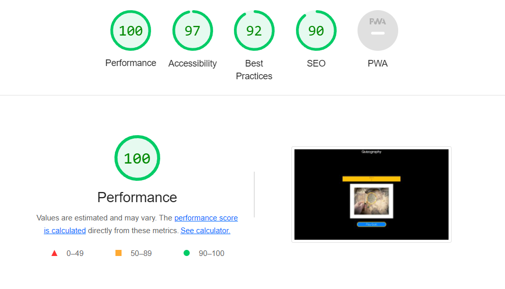

# Guess The Movie Quiz
Guess The Movie quiz is designed to test the user knowledge of movies based on still images from the selected movie. Each question is multiple choice, there are four options to choose from. The site has an intuitive design to allow any user to easily understand the concept. The user will be scored so they can try to beat their top scores or play with others to see who has the best movie knowledge.

## User Stories
### Site Owner
- As the site owner, I want to test the users geography knowledge.
- As the site owner, I want to track the user's score as they progress through the quiz.
- As the site owner, I want to take an input of a username for each user.
- As the site owner, I want to receive feedback from the user.

### User 
- As a first time site user, I want to easily understand the premis on the quiz.
- As the site user, I want to test my geography knowledge.

## Features

### Existing Features

- Username submission section
    - This section allows the user to enter their name and will appear on the Top of the screen as the game is being run

- Scoring section
    -The scoring section keeps track of the users score based on the answers they have submitted

- Quiz section
    - The quiz section holds the main quiz which consists of the image and answer options
    - The image will change every time the user clicks the next button and moves on to the next question
    - The answers section holds four different answer options to choose from. If the user clicks the correct answer the selection button will turn green and a point will be added to their overall score, if incorrect the button will turn red and the user will not gain a point.

- Quiz Rating section
- The rating section allows users to rate the quiz from 1-5 based on their experience. This feedback will also help on improving the quiz in the future.

## Validator Testing 

### HTML

- No errors returned when checking site through W3C Validator

### CSS
- No errors found when stie was run through W3C CSS Validator

### Javascript
- No errors found when passing site through Jshint validator
    - There are 7 functions in this file.
    - Function with the largest signature take 1 arguments, while the median is 0.
    - Largest function has 9 statements in it, while the median is 4.
    - The most complex function has a cyclomatic complexity value of 2 while the median is 1.

### Lighthouse

- The site was deployed to GitHub pages. The steps to deploy are as follows:
    - In the GitHub repository, navigate to the Settings tab
    - From the source section drop-down menu, select the Master Branch
    - Once the master branch has been selected, the page will be automatically refreshed with a detailed ribbon display to indicate the successful deployment.
Link to live site:  https://rovan89.github.io/Guess_The_Movie/ 

## Bugs
| **Feature / Function** | **Expected Result** | **Actual Result** | **Action** |
|-------------|------------|---------------------|-------------------|
| Click chosen answer | Clicking an answer changes the colour to either green or red depending on the result, one point is added to the score if the user answered correctly. | Colour of the users answer changes appropriately. If the user keeps clicking the correct answer the score will continue to be incremented. Also The user can keep selecting answers until they find the correct answer | Create functions to disable quiz buttons once an answer has been selected |
| Play Again button | The quiz ends and the user can click the button to start a new game | The quiz ends and until the user gives feedback the game can't continue | Created a function to restet the game after the Plat Again button has been clicked |